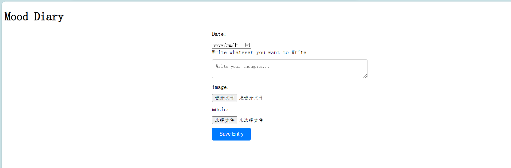

- this file record the problems i met, and also the solutions
  2023/10/23:
- Firstly, I made a overall framework using html/css/javascript
  
- then, I want to specify the storge. I find some problems.

  1.I just want to store the infor locally, but it seems that _I cannot directly specify a different folder or location on the user's device for localStorage in web browsers. The storage location and mechanisms for localStorage are managed by the browser itself, and it is intended to store data in a specific, controlled manner within the browser's storage infrastructure. This is for security and privacy reasons.The ability to specify a custom folder or location for storage would pose significant security risks and could potentially allow web pages to access and modify sensitive or unrelated files on the user's device, which is a security threat that web browsers aim to mitigate._
  **solution** :

  1. Server-Side Database: For a more robust and scalable solution, you can set up a server with a database (e.g., using technologies like Node.js, Express, and MongoDB) to store user entries. This requires server-side coding and provides better data management and security.
  2. Third-Party Services: You can use third-party services like Firebase, which offer easy ways to store and retrieve data in the cloud. Firebase provides real-time database capabilities and can be integrated into your web application.
